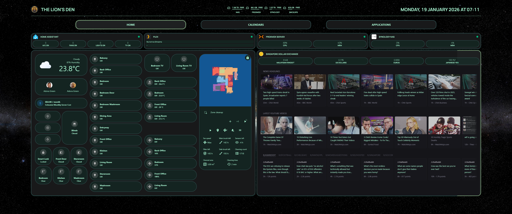
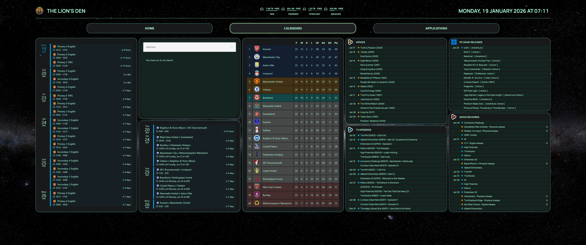
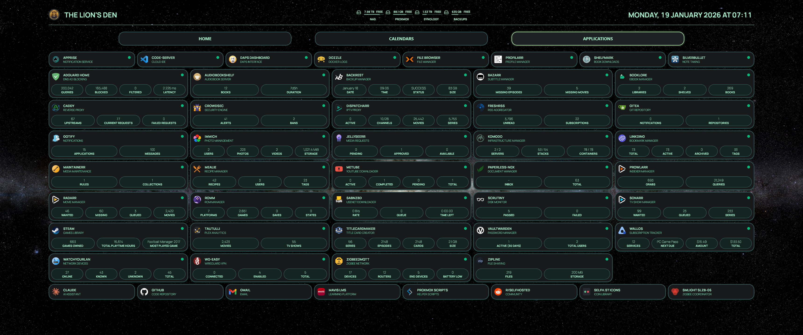

<p align="center">
  
</p>

<h1 align="center">The Lion's Den</h1>

<p align="center">
  <strong>A custom Homepage dashboard for self-hosted services</strong>
</p>

<p align="center">
  <a href="https://gethomepage.dev/"></a>
  <a href="#license"></a>
  <a href="#services"></a>
</p>

---

## Screenshots

<details open>
<summary><strong>Home</strong></summary>
<br>

</details>

<details>
<summary><strong>Calendars</strong></summary>
<br>

</details>

<details>
<summary><strong>Applications</strong></summary>
<br>

</details>

---

## Features

| Feature | Description |
|---------|-------------|
| **3 Tab Layout** | Home, Calendars, Applications |
| **45+ Services** | Media, networking, productivity, monitoring |
| **Custom Theme** | Dark emerald with custom CSS |
| **Home Assistant** | Embedded dashboards and device status |
| **Secure Config** | All secrets in environment variables |

---

## Services

<details>
<summary><strong>Media Management</strong></summary>

- Plex / Tautulli (streaming & analytics)
- Sonarr (TV shows)
- Radarr (movies)
- Bazarr (subtitles)
- Prowlarr (indexers)
- SABnzbd (downloads)
- Jellyseerr (requests)
- Audiobookshelf (audiobooks)
- Dispatcharr (IPTV)
- TitleCardMaker (title cards)
- Maintainerr (media maintenance)
- RomM (ROM management)

</details>

<details>
<summary><strong>Home & Monitoring</strong></summary>

- Home Assistant (smart home)
- Proxmox (virtualization)
- Synology NAS (storage)
- Scrutiny (disk health)
- WatchYourLAN (network devices)
- Zigbee2MQTT (Zigbee network)

</details>

<details>
<summary><strong>Productivity</strong></summary>

- Paperless-ngx (documents)
- Mealie (recipes)
- FreshRSS (news)
- Linkding (bookmarks)
- Booklore (ebooks)
- Shelfmark (book downloads)
- Wallos (subscriptions)
- Immich (photos)
- SilverBullet (notes)

</details>

<details>
<summary><strong>Infrastructure</strong></summary>

- AdGuard Home (DNS)
- Caddy (reverse proxy)
- CrowdSec (security)
- WireGuard / WG-Easy (VPN)
- Komodo (containers)
- Backrest (backups)
- Dozzle (Docker logs)
- File Browser (file management)

</details>

<details>
<summary><strong>Utilities</strong></summary>

- Gitea (Git repository)
- Vaultwarden (passwords)
- Gotify (notifications)
- Apprise (notification service)
- MeTube (YouTube downloader)
- Zipline (file sharing)
- Code-server (cloud IDE)
- Profilarr (profile management)
- Steam (games library)
- DAPS Dashboard (DAPS interface)

</details>

---

## Quick Start

```bash
# Clone
git clone https://github.com/LionCityGaming/homepage.git

# Configure
cp .env.example .env
# Edit .env with your API keys, URLs, and passwords

# Deploy to your Homepage instance
```

---

## File Structure

```
services.yaml      # Service definitions with widgets
settings.yaml      # Layout, theme, and display settings
widgets.yaml       # Header widgets (logo, datetime, resources)
custom.css         # Custom styling and theme overrides
custom.js          # Custom JavaScript
.env.example       # Template for environment variables
```

---

## Environment Variables

| Pattern | Example |
|---------|---------|
| `HOMEPAGE_VAR_{SERVICE}_API_KEY` | `HOMEPAGE_VAR_SONARR_API_KEY` |
| `HOMEPAGE_VAR_{SERVICE}_URL` | `HOMEPAGE_VAR_SONARR_URL` |
| `HOMEPAGE_VAR_{SERVICE}_USERNAME` | `HOMEPAGE_VAR_SYNOLOGY_USERNAME` |
| `HOMEPAGE_VAR_{SERVICE}_PASSWORD` | `HOMEPAGE_VAR_SYNOLOGY_PASSWORD` |

---

## Credits

- [Homepage](https://gethomepage.dev/) — Dashboard framework
- [selfh.st Icons](https://selfh.st/icons/) — Service icons
- [Home Assistant](https://www.home-assistant.io/) — Smart home platform

---

## License

MIT
