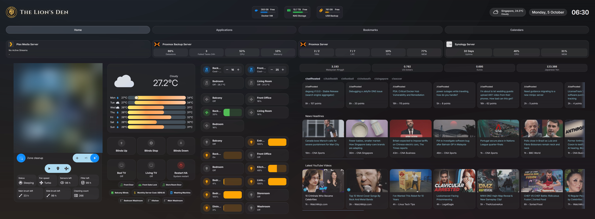
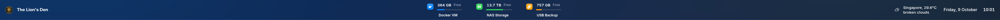
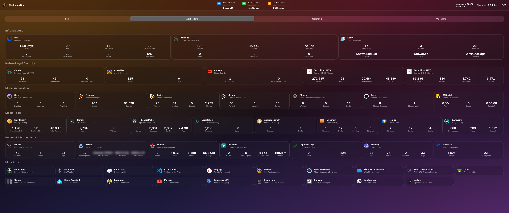
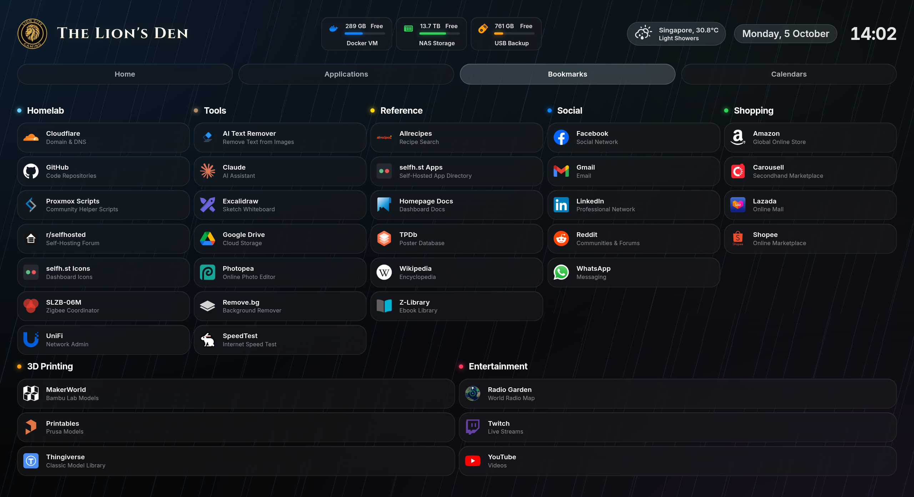
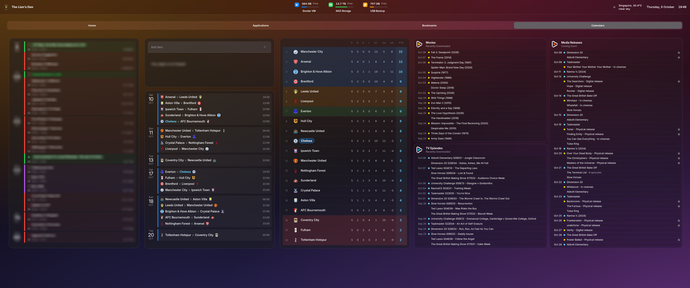
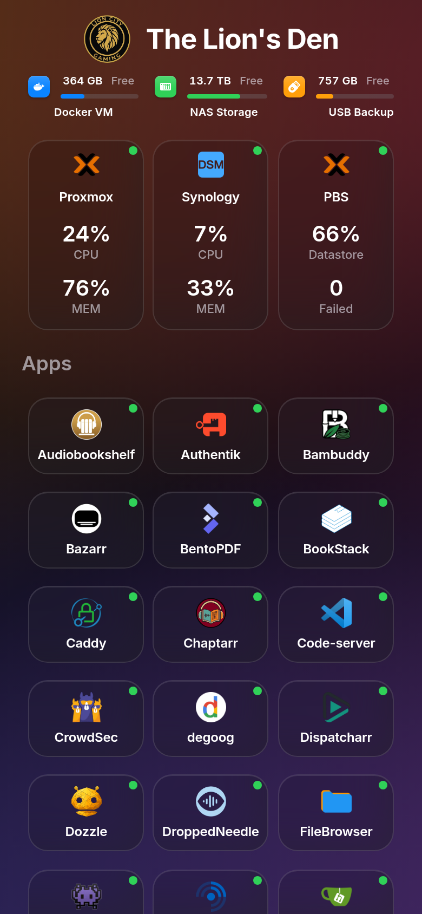

  

<h1 align="center">The Lion's Den</h1>

  <strong>A frosted-glass <a href="https://gethomepage.dev">Homepage</a> dashboard for a self-hosted homelab</strong> 
  Apple-style glass cards, a background that follows the time of day and the weather, and Home Assistant and Glance panels that blend right in.

  
  
  
  

---

## Highlights

- **Glass everywhere.** Every card is a frosted, see-through panel with a hairline edge, in the style of Apple's dark mode. No thick borders, no heavy shadows.
- **A living background.** A soft colour glow that changes with the time of day (night, dawn, day, dusk), drifts very slowly, and follows the weather: dimmer when it's overcast, faint rain streaks when it rains, the odd flash in a thunderstorm.
- **A colour for every section.** Each group gets its own accent (shown as a glowing dot before its name, and as a glow when you hover a card).
- **A clock that looks like a smart display.** The weather and date sit in glass capsules, with the time in large bold digits.
- **Disk capsules.** Each disk in the top bar has its own icon and colour, turning amber at 75% and red at 90%, and they always sit in the middle of the bar.
- **Glass search.** Start typing anywhere and the quick-launch search opens as a frosted sheet over a dimmed, blurred page.
- **Quiet status dots.** Healthy services don't show a green dot until you hover them, so the ones that need attention stand out.
- **Embedded panels that match.** Home Assistant dashboards and Glance are shown inside Homepage with the same glass look (see [Extras](#extras)).

## Tabs

| Tab | What's on it |
|---|---|
| **Home** | Server stats (Proxmox, PBS, Synology, Plex), a Home Assistant panel, exchange rates and a Glance news feed |
| **Applications** | Every self-hosted app, grouped: Infrastructure, Networking & Security, Media Acquisition, Media Tools, Personal & Productivity, More Apps |
| **Bookmarks** | Everyday links: 3D Printing, Homelab, Homelab Help, Reference, Shopping, Social & Media, Tools, Work & Admin |
| **Calendars** | Calendars, a to-do list, Premier League fixtures and table, recently downloaded films and episodes, and upcoming releases |
| **Mobile** | A compact status view used automatically on phones (see [On phones](#on-phones)) |

The tab bar works like an iOS segmented control: one glass track, with the open tab as a white pill.

## On phones

Phones get their own compact layout automatically (no separate app or URL):

- The crest and title on one line, and the three disks side by side
- Proxmox, Synology and Proxmox Backup Server as three server cards, each with its two key numbers
- Every app as a small tile, three across, with its status dot always showing so the page works as a quick health check
- The weather capsule is left out (the phone already shows the weather), but the background still follows it
- Tabs are hidden: the Mobile tab is the whole page

 

## Files

| File | What it does |
|---|---|
| `settings.yaml` | Layout, tabs and theme settings |
| `services.yaml` | Every service and its widget |
| `widgets.yaml` | The top bar: crest, title, weather, date, time and disks |
| `custom.css` | The whole look, grouped by part of the page (page and background, cards, status dots, tabs, top bar, embedded panels, Calendars lists, search, motion), each part with its own phone rules |
| `custom.js` | Small helpers: section colours, disk colours and icons, the clock layout, time-of-day and weather moods, the phone layout, Bookmarks columns arranged as a peak (most links in the middle), tidier dates in the Calendars lists, and one row per show in Media Releases when several episodes come out on the same day ("The Terminal List · 8 episodes", every episode in its tooltip), matching labels for the few widgets that word theirs differently, and phone app names that shrink to fit their tile |
| `.env.example` | Every variable the config uses, with no values |
| `extras/` | Matching styles for Home Assistant and Glance |

## Setup

1. Copy the files into your Homepage `config` folder.
2. Copy `.env.example` to `.env`, fill in what you use, and pass it to the Homepage container (`env_file: .env` in compose). Homepage swaps every `{{HOMEPAGE_VAR_...}}` in the YAML for the matching variable.
3. Delete the services you don't run from `services.yaml`, and their groups from the `layout` in `settings.yaml`.
4. Set your own location in the `openweathermap` widget in `widgets.yaml` (it's set to Singapore) and add a free [OpenWeatherMap](https://openweathermap.org/) API key as `HOMEPAGE_VAR_OPENWEATHERMAP_API_KEY`. No key? Swap it for Homepage's `openmeteo` widget, which needs none.
5. Service icons under `/images/icons/` are local files; swap them for [dashboard icons](https://github.com/homarr-labs/dashboard-icons) or your own.

The disk names that get their own icon and colour (`Docker VM`, `NAS Storage`, `USB Backup`) and each section's colour are set in the `DISKS` and `ACCENTS` lists in `custom.js`, so rename them there to match your own labels.

## Extras

- **`extras/home-assistant-glass-embed.js`** makes Home Assistant dashboards that are embedded in Homepage see-through, with glass cards and the same font. It only kicks in when a dashboard is shown inside an iframe, so Home Assistant itself looks unchanged. Instructions are at the top of the file.
- **`extras/glance-glass.css`** does the same for [Glance](https://github.com/glanceapp/glance): add it to the end of your Glance custom CSS.

## Credits

- [Homepage](https://github.com/gethomepage/homepage) by the gethomepage team
- Fonts: [Inter](https://rsms.me/inter/) and [Cinzel](https://fonts.google.com/specimen/Cinzel) from Google Fonts
- Icons: [Material Design Icons](https://pictogrammers.com/library/mdi/) (embedded) and [dashboard icons](https://github.com/homarr-labs/dashboard-icons)
- Weather: [OpenWeatherMap](https://openweathermap.org/) (free API key), the same source as the Home Assistant weather card

## License

MIT. Use it, change it, share it.
